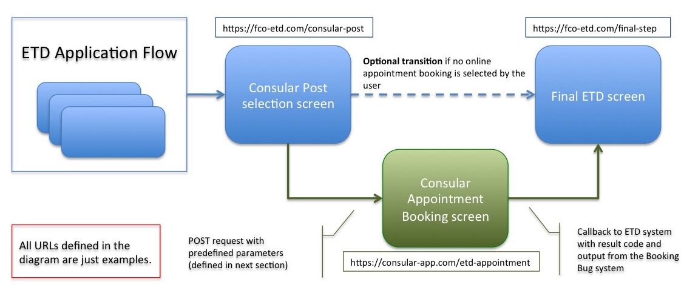

# ETD - BookingBug Integration Specification

## Contents

1. [Intended Audience](#intendedAudience)
2. [Conventions](#conventions)
3. [Introduction](#introduction)
4. [Protocol and Format](#protocol)

### (1) Intended Audience

This document has been designed to define the interface between the BookingBug Consular Appointment Booking screen and the ETD web form application. 

The interface will be agreed and maintained by both the **ETD and the BookingBug teams**. 

This is a low level technical document that details the HTTP requests and responses, hence the scope of it is only at a technical integration level. No functional or business cases are documented here.

The canonical home of this document is as part of the github repository that contains the documentation for the ETD project. Access to this is controlled by FCO and can be granted on an individual basis.

### (2) Conventions

* [Date/Time](http://docs.oracle.com/javase/7/docs/api/java/text/SimpleDateFormat.html) formats are based on Java standards

* The service will be available only on **HTTPS**

### (3) Introduction

As part of the ETD application process, the option to book an appointment with the consular staff online is offered to the user.

BookingBug offer a set of UI widgets and API to perform the integration with their booking system. BookingBug will be responsible for the development of the ETD "Book your appointment" screen so an integration work needs to be carried out to "inject" this step/screen into the ETD application flow seamlessly. 

The main work here is to define both the **input fields** to be sent to BookingBug when calling the appointment screen and **the callback and the response parameters** from BookingBug that the ETD web application will receive.

 

### (4) Protocol and Format

* As communication between the ETD and BookingBug sites will be done through the Internet, **HTTPS** will be used as the communications protocol to to transfer encrypted information.

* A POST request with input parameters will be sent from the ETD to the BookingBug site. Also, a URL callback will be provided so that the BookingBug site can redirect to the ETD site once the booking has been completed.

* Initially the integration will not consider hiding the BookingBug site URL, meaning that the user will see a different URL in the browser when redirecting from the ETD to the BB site. However, this feature will be needed later on. For this to be possible (proxying through the ETD web server to the BB site), we need the BB site to always provide **relative paths**, as the ETD web server will need to rewrite all links in HTML content from BB, to allow this redirection.

##### Description of request parameters (POST method) from ETD to BookingBug site:

* URL: https://[booking-bug-url]/slot-picker **[TBD]**
* HTTP Method: POST
* Required Headers: **[TBD]**

|Parameter name|Description|Format|Mandation|Maximum length|
|-------------|-------------|-------------|-------------|-------------|
|etdToken|ETD session token id (needed for the callback)|Alphanumeric/Text (hash)|Required|64 characters|
|callbackURL|ETD URL to be called after the user clicks on "Next" in BookingBug appointment screen|Text|Required|256 characters|
|companyID|Consular Post selected by the user|Numeric|Required|**TBD**|
|firstName|ETD applicant's first name|Text|Required|**TBD**|
|lastName|ETD applicant's last name|Text|Required|**TBD**|
|email|ETD applicant's email address|Text (xxx@yyy)|Required|**TBD**|
|contactPhoneNumber|ETD applicant's contact phone number|Text (may contain letters and symbols)|Required|**TBD**|
|etdReason|Applicant's reason to apply for an ETD|Range of predefined values ['Lost','Stolen']|Required|Predefined values|
|feedbackOptIn|Opt-in checkbox for the user to indicate whether they permit the FCO to contact them for feedback|Boolean|Required ('Y', 'N')|1 character|

##### Description of request parameters (POST method) to ETD application (callback's parameters):

* URL: https://[etd-application-url]/appointment/redirect **[TBD]**
* HTTP Method: POST
* Required Headers: **[TBD]**

|Parameter name|Description|Format|Mandation|Maximum length|
|-------------|-------------|-------------|-------------|-------------|
|etdToken|ETD session token id (needed for for the callback)|Alphanumeric/Text (hash)|Required|64 characters|
|resultCode|Code which describes the result of the booking (if there's an error in the process, ETD application should control it to redirect the user to a proper error screen)|**TBD**|Required|**TBD**|
|appointmentDate|ETD applicant's selected appointment date|Text ('dd-MM-yyyy')|Required|10 characters|
|appointmentTime|ETD applicant's selected time slot|Text ('HH:mm')|Required|5 characters|
